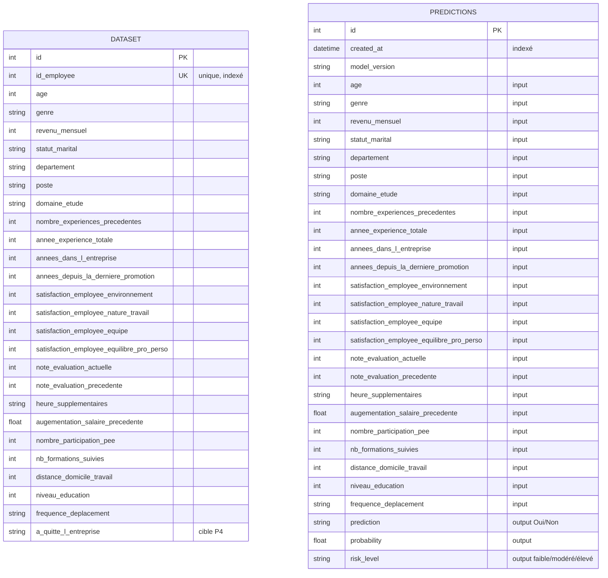

# Étape 4 — Insérer le dataset et le gérer via PostgreSQL

## Objectif
Créer une base PostgreSQL via un script SQL (ou Python) pour y insérer le dataset complet.
**Toutes les interactions avec le modèle ML devront passer par la base de données** : inputs envoyés au modèle et outputs générés doivent être enregistrés dans des tables dédiées.

L'interaction avec la DB peut rester **entièrement locale** pour simplifier.

## Prérequis
- [x] Connaissance de base de PostgreSQL et des concepts relationnels
- [x] Familiarité avec un ORM (SQLAlchemy)
- [x] Compréhension des interactions API ↔ base de données
- [x] Dataset du projet P4 disponible (3 CSV)
- [x] PostgreSQL via conteneur Docker

## Tâches à réaliser

### 1. Modélisation de la base
- [x] Concevoir le schéma des tables nécessaires :
  - Table `dataset` (données brutes RH fusionnées depuis les 3 CSV)
  - Table `predictions` (inputs + outputs + métadonnées dans une seule table)
- [x] Identifier les types de colonnes, clés primaires, contraintes
- [x] Produire un schéma UML (diagramme ERD Mermaid ci-dessous)

### Schéma ERD

> Les deux tables sont indépendantes (pas de FK) : `dataset` est le référentiel RH
> source, `predictions` journalise chaque appel API avec input + output + métadonnées.
> Le rapprochement éventuel se fait applicativement via l'endpoint
> `POST /predict/employee/{id_employee}` qui lit `dataset` et écrit `predictions`.

### 2. Scripts de création
- [x] Créer `db/create_db.py` — création des tables via SQLAlchemy
- [x] Tables créées automatiquement au startup de l'API (`Base.metadata.create_all`)
- [x] Script d'insertion du dataset (`scripts/seed_db.py` — import des 3 CSV fusionnés)
- [x] Documenter comment exécuter ces scripts

### 3. Intégration avec l'API (SQLAlchemy)
- [x] Installer `sqlalchemy` + `psycopg[binary]` (dans `pyproject.toml`)
- [x] Créer `db/database.py` : engine + session
- [x] Créer `db/models.py` : modèles ORM (Dataset + Prediction)
- [x] Créer une dépendance FastAPI `get_db()` pour injecter la session
- [x] Gérer la configuration via variables d'environnement (`.env` + Pydantic Settings `app/config.py`)

### 4. Enregistrement systématique des échanges
- [x] À chaque appel de `/predict` : enregistrer l'input dans la DB
- [x] Enregistrer l'output (prédiction + probabilité + risk_level + timestamp + version modèle)
- [x] Input et output liés dans la même ligne (table `predictions`)
- [x] Gérer les erreurs pour ne jamais laisser d'état incohérent (transactions)

### 5. Endpoints d'interrogation
- [x] `GET /predictions` : liste des prédictions récentes (avec pagination skip/limit)
- [x] `GET /predictions/{id}` : détail d'une prédiction

### 6. Données d'exemple
- [x] Dataset complet importé via `scripts/seed_db.py` (1470 lignes)
- [x] Le script vérifie si les données existent déjà avant d'insérer (idempotent)

### 7. Documentation technique
- [x] Structure des tables documentée dans `db/models.py` (modèles ORM commentés)
- [x] Configuration Docker Compose (`docker-compose.yml` : API + PostgreSQL)
- [x] Variables d'environnement documentées dans `.env.example`

## Résultats attendus
- [x] Schéma UML de la BDD (ERD Mermaid intégré ci-dessus)
- [x] Script `db/create_db.py` + auto-création au startup
- [x] Dataset inséré et correctement structuré (1470 lignes)
- [x] Enregistrement systématique des inputs/outputs dans la table `predictions`
- [x] Traçabilité complète des échanges API ↔ DB
- [x] Exemples d'entrées fournis (seed)

## Points de vigilance
- **Sécurité des données** : pas de credentials en dur, gestion via `.env` + `secrets`
- **Cohérence** : garantir que chaque prédiction est bien persistée (transaction atomique)
- **Performance** : index sur `created_at` et `id_employee`
- Séparer la connexion DB de la logique métier

## Outils
- PostgreSQL 16 (via Docker)
- SQLAlchemy 2.0
- Psycopg 3

## Ressources
- Documentation officielle PostgreSQL
- Tutoriels et guides SQLAlchemy
- Documentation Psycopg 3

## Checkpoint mentor
À la fin de cette étape, faire le point avec le mentor pour valider le schéma DB et l'intégration API ↔ DB.

## Statut global étape : **TERMINÉE**.
